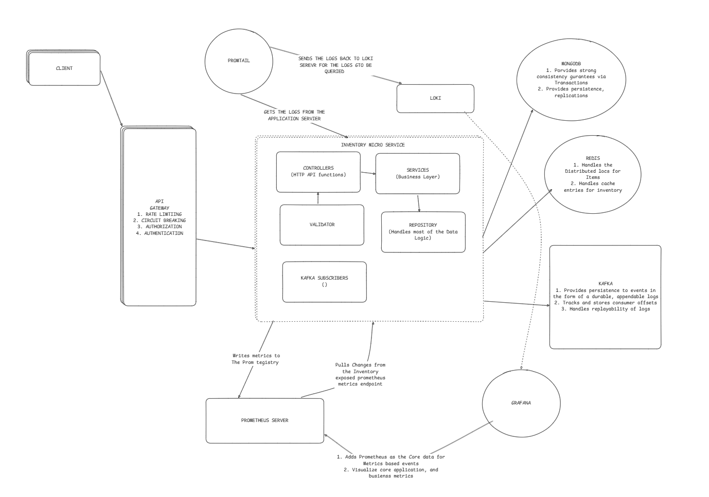

# Inventory Service
High-performance inventory management service with stock reservation, atomic operations, and data integrity guarantees for e-commerce platforms built with Nodejs, Kafka, Typescript, and Jest.

## Table of Contents

- [Overview](#overview)
- [Features](#features)
- [Architecture](#architecture)
- [Prerequisites](#prerequisites)
- [Installation](#installation)
- [Configuration](#configuration)
- [API Reference](#api-reference)
- [Event System](#event-system)
- [Data Integrity](#data-integrity)
- [Error Handling](#error-handling)
- [Monitoring](#monitoring)
- [Development](#development)
- [Testing](#testing)
- [Deployment](#deployment)
- [Troubleshooting](#troubleshooting)

## Overview

The Inventory Service manages product stock levels with features including:

- **Stock Reservation System** - Reserve items for carts/orders without committing
- **Atomic Operations** - Distributed locking prevents race conditions
- **Data Invariant Enforcement** - Guarantees `quantityOnHand = quantityAvailable + quantityReserved`
- **Idempotent Operations** - Safe retries via saga IDs
- **Event-Driven Architecture** - Kafka integration for service coordination
- **Automatic Rollback** - Releases reservations on failures

## Features

### Core Functionality
- Reserve stock for cart items (temporary hold)
- Commit stock for completed orders (permanent deduction)
- Release stock for abandoned carts (return to available)
- Check stock availability (real-time queries)
- Inventory CRUD operations with validation
- Automatic rollback on partial failures

### Reliability & Performance
- Distributed locking (30-second TTL with auto-release)
- Idempotency via Redis (1-hour deduplication window)
- Timeout protection (25-second operation limit)
- Data invariant validation on every operation
- MongoDB transactions for atomicity
- Redis caching with proactive invalidation

### Integration
- Kafka event consumption (order lifecycle events)
- RESTful API for Cart and Order services
- Batch reservation with all-or-nothing semantics

## Architecture

### Data Flow: Stock Reservation

```
1. Order Service → POST /reserve
2. Acquire distributed lock (Redis)
3. Check idempotency (Redis cache)
4. Validate stock available ≥ quantity
5. MongoDB transaction:
   - Decrement quantityAvailable
   - Increment quantityReserved
   - Validate invariants
6. Invalidate cache (Redis)
7. Release lock
8. Cache result for idempotency
9. Return reservation details
```

### Data Flow: Batch Reservation (via Kafka)

```
1. Order Service publishes ORDER_CHECKOUT_STARTED
2. Inventory Subscriber receives event
3. For each item:
   a. Reserve stock
   b. Track success
   c. On failure → Rollback all previous
4. If all succeed → Done
5. If any fail → Send ORDER_RESERVATION_FAILED event
```

## Prerequisites

- **Node.js**: >= 18.x
- **MongoDB**: >= 5.0 (with replica set for transactions)
- **Redis**: >= 6.0 (for locks and caching)
- **Kafka**: >= 2.8 (for event-driven architecture)

## Installation

```bash
# Clone repository
git clone https://github.com/yourorg/inventory-service.git
cd inventory-service

# Install dependencies
npm install

# Copy environment template
cp .env.example .env

# Configure environment variables
nano .env
```

## Configuration

### Environment Variables

```bash
# Server Configuration
PORT=4008
NODE_ENV=production

# MongoDB Configuration
MONGODB_URI=mongodb://mongo:27017/inventory-service
MONGODB_REPLICA_SET=rs0

# Redis Configuration
REDIS_HOST=redis
REDIS_PORT=6379
REDIS_PASSWORD=your-redis-password
REDIS_DB=0

# Kafka Configuration
KAFKA_BROKERS=kafka-1:9092,kafka-2:9093,kafka-3:9094
KAFKA_CLIENT_ID=inventory-service
KAFKA_GROUP_ID=inventory-service-group

# Lock Configuration
LOCK_TTL=30                # Distributed lock TTL in seconds
OPERATION_TIMEOUT=25000    # Operation timeout in milliseconds

# Cache Configuration
INVENTORY_CACHE_TTL=300    # Cache TTL in seconds (5 minutes)

# Feature Flags
ENABLE_INVARIANT_VALIDATION=true
ENABLE_IDEMPOTENCY=true
ENABLE_TIMEOUT_PROTECTION=true

# Logging
LOG_LEVEL=info             # debug | info | warn | error
```

### Kafka Topics

**Topics Inventory Service is consuming:**
```bash
product.onboarding.completed.topic   
order.checkout.started.topic          # Reserve stock
order.payment.completed.topic         # Commit stock
order.payment.failed.topic            # Release stock
```

**Topics Inventory Service did published:**
```bash
order.reservation.failed.topic        # Reservation failed event
```

### MongoDB Indexes

```javascript
// Required indexes
db.inventory.createIndex({ storeId: 1, sku: 1 }, { unique: true });
db.inventory.createIndex({ storeId: 1, isLowStock: 1 });
db.inventory.createIndex({ ownerId: 1, isLowStock: 1 });
db.inventory.createIndex({ sku: 1 });
db.inventory.createIndex({ productId: 1 });
```

## API Reference

### Base URL
```
http://localhost:4008/api/v1/inventories
```

### Authentication
Most endpoints require JWT authentication via `Authorization: Bearer <token>` header.
**Exception:** Reserve/Release/Commit endpoints are called by services (no auth required).

---

### Reserve Stock

**POST** `/reserve`

Reserve stock for a cart or order without permanent deduction.

**Request Body:**
```json
{
  "storeId": "507f1f77bcf86cd799439011",
  "productId": "507f1f77bcf86cd799439012",
  "quantity": 2,
  "userId": "507f1f77bcf86cd799439013",
  "sagaId": "order-1706356200000-user-123-req-456",
  "reservationType": "cart"
}
```

**Response (201):**
```json
{
  "success": true,
  "reservationId": "order-1706356200000-user-123-req-456-507f1f77bcf86cd799439012",
  "expiresAt": "2026-01-27T11:00:00.000Z",
  "quantityReserved": 2,
  "remainingAvailable": 18
}
```

**Response (400) - Insufficient Stock:**
```json
{
  "success": false,
  "availableStock": 1,
  "message": "Insufficient stock. Only 1 available."
}
```

**Response (409) - Lock Contention:**
```json
{
  "success": false,
  "message": "Stock reservation in progress. Please retry."
}
```

**Idempotency:**
- Uses `sagaId` for deduplication
- Duplicate requests return cached result
- Safe to retry on network failures

---

### Release Stock

**POST** `/release`

Release previously reserved stock back to available inventory.

**Request Body:**
```json
{
  "storeId": "507f1f77bcf86cd799439011",
  "productId": "507f1f77bcf86cd799439012",
  "quantity": 2,
  "userId": "507f1f77bcf86cd799439013",
  "sagaId": "release-1706356200000-user-123-req-456",
  "reservationType": "cart"
}
```

**Response (200):**
```json
{
  "success": true,
  "releasedQuantity": 2,
  "newAvailable": 20,
  "remainingReserved": 5
}
```

**Response (400) - Insufficient Reservation:**
```json
{
  "success": false,
  "message": "Cannot release more than currently reserved"
}
```

**Use Cases:**
- User removes item from cart
- User decreases cart quantity
- Cart expires (30 days)
- Payment fails after reservation
- Rollback after partial reservation failure

---

### Commit Stock

**POST** `/commit`

Permanently commit reserved stock (deduct from physical inventory).

**Request Body:**
```json
{
  "storeId": "507f1f77bcf86cd799439011",
  "productId": "507f1f77bcf86cd799439012",
  "quantity": 2,
  "userId": "507f1f77bcf86cd799439013",
  "sagaId": "commit-1706356200000-user-123-req-456"
}
```

**Response (200):**
```json
{
  "success": true,
  "committedQuantity": 2,
  "remainingOnHand": 98,
  "remainingReserved": 3
}
```

**Response (404) - Reservation Not Found:**
```json
{
  "success": false,
  "message": "Reservation not found. May have been already committed or released."
}
```

**When Called:**
- Payment successfully completed
- Order confirmed
- This is the final step in the order flow

---

### Check Availability

**GET** `/check/:productId?storeId={storeId}`

Check real-time stock availability for a product.

**Response (200):**
```json
{
  "productId": "507f1f77bcf86cd799439012",
  "storeId": "507f1f77bcf86cd799439011",
  "quantityAvailable": 18,
  "quantityOnHand": 100,
  "quantityReserved": 82
}
```

**Response (404):**
```json
{
  "quantityAvailable": 0,
  "message": "Product not found"
}
```

**Note:**
- `quantityAvailable` = What can be added to cart NOW
- `quantityOnHand` = Physical stock in warehouse
- `quantityReserved` = Items held for pending orders/carts
- **Invariant:** `quantityOnHand = quantityAvailable + quantityReserved`

---

### Create Inventory

**POST** `/:storeId/store`

Create new inventory record for a product.

**Request Body:**
```json
{
  "productId": "507f1f77bcf86cd799439012",
  "sku": "SHOES-RUN-001",
  "productTitle": "Running Shoes",
  "productImage": "https://example.com/shoes.jpg",
  "quantityOnHand": 100,
  "quantityAvailable": 100,
  "quantityReserved": 0,
  "reorderPoint": 10,
  "reorderQuantity": 50
}
```

**Response (201):**
```json
{
  "_id": "507f1f77bcf86cd799439015",
  "ownerId": "507f1f77bcf86cd799439013",
  "storeId": "507f1f77bcf86cd799439011",
  "productId": "507f1f77bcf86cd799439012",
  "sku": "SHOES-RUN-001",
  "quantityOnHand": 100,
  "quantityAvailable": 100,
  "quantityReserved": 0,
  "createdAt": "2026-01-27T10:30:00.000Z"
}
```

**Validation:**
- Enforces `quantityOnHand = quantityAvailable + quantityReserved`
- SKU must be unique per store
- All quantities must be non-negative

---

### Get All Inventory

**GET** `/:storeId/store`

Retrieve all inventory items for a store with pagination.

**Query Parameters:**
- `page` (default: 1)
- `limit` (default: 10)

**Response (200):**
```json
{
  "data": {
    "inventorys": [...],
    "totalCount": 150,
    "totalPages": 15
  },
  "success": true,
  "statusCode": 200
}
```

---

### Get Single Inventory

**GET** `/:id`

Retrieve a specific inventory item by MongoDB ObjectId.

**Response (200):**
```json
{
  "_id": "507f1f77bcf86cd799439015",
  "productId": "507f1f77bcf86cd799439012",
  "quantityAvailable": 18,
  ...
}
```

---

### Update Inventory

**PUT** `/:id`

Update inventory quantities or metadata.

**Request Body:**
```json
{
  "quantityOnHand": 120,
  "reorderPoint": 15
}
```

**Response (200):**
```json
{
  "_id": "507f1f77bcf86cd799439015",
  "quantityOnHand": 120,
  "reorderPoint": 15,
  ...
}
```

**IMPORTANT:**
- **It wont proceed, if `quantityReserved > 0`**
- There is no room to modify inventory with active reservations, and the owner has to wait 
for the reservations to be committed/released before any edit can be made. 
The goal wa to ensure strong consistency between the cart, inventory, and order service

**Error (400) - Active Reservations:**
```json
{
  "error": "Cannot modify inventory with 5 items reserved. Wait for reservations to clear."
}
```

---

### Delete Inventory

**DELETE** `/:id`

Delete an inventory record.

**Response (200):**
```json
{
  "message": "Inventory deleted successfully"
}
```

**IMPORTANT:**
- **It wont proceed, if `quantityReserved > 0`**
- There is no room to elete inventory with active reservations, and the owner has to wait 
for the reservations to be committed/released before any edit can be made. 
The goal wa to ensure strong consistency between the cart, inventory, and order service

**Error (400) - Active Reservations:**
```json
{
  "error": "Cannot delete inventory with 5 items reserved."
}
```

---

## Event System

### Consumed Events

#### product.onboarding.completed.topic

Triggered when a new product is created in the Product Service.

```json
{
  "productId": "507f1f77bcf86cd799439012",
  "storeId": "507f1f77bcf86cd799439011",
  "ownerId": "507f1f77bcf86cd799439013",
  "sku": "SHOES-RUN-001",
  "title": "Running Shoes",
  "image": "https://example.com/shoes.jpg",
  "availableStock": 100,
  "thresholdStock": 10,
  "ownerName": "Store Owner",
  "idempotencyId": "product-onboard-123"
}
```

**Actions:**
- Creates corresponding inventory record
- Sets `quantityOnHand = availableStock`
- Sets `quantityAvailable = availableStock`
- Sets `quantityReserved = 0`
- Idempotent via `idempotencyId`

---

#### order.checkout.started.topic

Triggered when Order Service creates an order.

```json
{
  "orderId": "507f1f77bcf86cd799439020",
  "storeId": "507f1f77bcf86cd799439011",
  "userId": "507f1f77bcf86cd799439013",
  "sagaId": "order-1706356200000-user-123-req-456",
  "items": [
    {
      "productId": "507f1f77bcf86cd799439012",
      "productTitle": "Running Shoes",
      "quantity": 2,
      "price": 79.99
    }
  ],
  "totalPrice": 159.98
}
```

**Actions:**
1. Reserve stock for each item
2. Track successful reservations
3. **On failure:**
   - Rollback all previously reserved items
   - Send `ORDER_RESERVATION_FAILED` event
4. **Includes timeout protection:**
   - Per-item timeout: 5 seconds
   - Batch timeout: 25 seconds

---

#### order.payment.completed.topic

Triggered when payment is successfully processed.

```json
{
  "orderId": "507f1f77bcf86cd799439020",
  "sagaId": "order-1706356200000-user-123-req-456",
  "items": [
    {
      "productId": "507f1f77bcf86cd799439012",
      "quantity": 2
    }
  ],
  "storeId": "507f1f77bcf86cd799439011"
}
```

**Actions:**
- Commit reserved stock for each item
- Decrement `quantityOnHand`
- Decrement `quantityReserved`
- `quantityAvailable` remains unchanged (already deducted)
- Idempotent via `sagaId`

---

#### order.payment.failed.topic

Triggered when payment processing fails.

```json
{
  "orderId": "507f1f77bcf86cd799439020",
  "sagaId": "order-1706356200000-user-123-req-456",
  "reason": "Card declined",
  "items": [
    {
      "productId": "507f1f77bcf86cd799439012",
      "quantity": 2
    }
  ],
  "storeId": "507f1f77bcf86cd799439011"
}
```

**Actions:**
- Release all reserved stock
- Increment `quantityAvailable`
- Decrement `quantityReserved`
- Items returned to available pool

---

### Published Events

#### order.reservation.failed.topic

Published when stock reservation fails for an order.

```json
{
  "orderId": "507f1f77bcf86cd799439020",
  "sagaId": "order-1706356200000-user-123-req-456",
  "userId": "507f1f77bcf86cd799439013",
  "storeId": "507f1f77bcf86cd799439011",
  "reason": "INSUFFICIENT_STOCK: No sufficient inventory stock",
  "failedItems": [
    {
      "productId": "507f1f77bcf86cd799439012",
      "productTitle": "Running Shoes",
      "reason": "Out of stock"
    }
  ],
  "failedAt": "2026-01-27T10:30:00.000Z"
}
```

**Consumers:**
- **Order Service:** Marks order as OUT_OF_STOCK
- **Cart Service:** Marks cart items as unavailable (doesn't remove them)

---

## Data Integrity

### The Golden Invariant

**ALWAYS TRUE:**
```
quantityOnHand = quantityAvailable + quantityReserved
```

### Example Lifecycle

**Initial State:**
```json
{
  "quantityOnHand": 100,
  "quantityAvailable": 100,
  "quantityReserved": 0
}
```

**After Reserve(10):**
```json
{
  "quantityOnHand": 100,     // Unchanged (still in warehouse)
  "quantityAvailable": 90,   // -10 (can't sell to others)
  "quantityReserved": 10     // +10 (held for this order)
}
```
Invariant: 100 = 90 + 10

**After Commit(10):**
```json
{
  "quantityOnHand": 90,      // -10 (shipped out)
  "quantityAvailable": 90,   // Unchanged
  "quantityReserved": 0      // -10 (no longer reserved)
}
```
Invariant: 90 = 90 + 0

**If Payment Failed and Release(10):**
```json
{
  "quantityOnHand": 100,     // Unchanged (still in warehouse)
  "quantityAvailable": 100,  // +10 (available again)
  "quantityReserved": 0      // -10 (released)
}
```
Invariant: 100 = 100 + 0

### Validation Points

**Invariant checked:**
- After every `reserveStock()`
- After every `commitStock()`
- After every `releaseStock()`
- On `createInventory()`
- On `updateInventory()`

**If Violated:**
- Operation throws error
- Transaction rolls back
- Error logged with full context
- Alert sent to ops team

---

## Error Handling

### Error Types

#### INSUFFICIENT_STOCK
```json
{
  "success": false,
  "availableStock": 5,
  "message": "Insufficient stock. Only 5 available."
}
```
**Cause:** Not enough `quantityAvailable` for reservation
**Action:** User should reduce quantity or choose different product

---

#### STOCK_CONTENTION
```json
{
  "success": false,
  "message": "Stock reservation in progress. Please retry."
}
```
**Cause:** Distributed lock held by another instance
**Action:** Retry after exponential backoff

---

#### INSUFFICIENT_RESERVATION
```json
{
  "success": false,
  "message": "Cannot release more than currently reserved"
}
```
**Cause:** Trying to release more than actually reserved
**Action:** Check reservation state, may already be released

---

#### RESERVATION_NOT_FOUND
```json
{
  "success": false,
  "message": "Reservation not found. May have been already committed or released."
}
```
**Cause:** Commit called but reservation doesn't exist
**Action:** Check if already committed or never reserved

---

#### INVARIANT_VIOLATION
```json
{
  "error": "Inventory data inconsistency: onHand(100) != available(90) + reserved(5)"
}
```
**Cause:** Data corruption or concurrent modification bug
**Action:** CRITICAL - Manual investigation required

---

### Retry Strategy

**Client-side:**
- Retry on `STOCK_CONTENTION` with exponential backoff (2s, 4s, 8s)
- Don't retry on `INSUFFICIENT_STOCK` (won't succeed)
- Retry on 500 errors (server issues)
- Don't retry on 400 errors (validation failures)

**Service-side:**
- MongoDB transactions auto-retry on transient errors
- Kafka consumers retry failed event processing
- Lock operations timeout after 25 seconds

---

## Monitoring

### Key Metrics

**Reservation Operations:**
```
inventory_reserve_requests_total (counter)
inventory_reserve_duration_seconds (histogram)
inventory_reserve_success_rate (gauge)
inventory_reserve_failures_by_reason (counter)
```

**Data Integrity:**
```
inventory_invariant_violations_total (counter) - SHOULD BE ZERO
inventory_negative_quantity_detected_total (counter) - SHOULD BE ZERO
```

**Lock Performance:**
```
inventory_lock_acquisition_duration_seconds (histogram)
inventory_lock_contention_rate (gauge)
inventory_lock_timeout_total (counter) - SHOULD BE ZERO
```

**Rollback Operations:**
```
inventory_rollback_attempts_total (counter)
inventory_rollback_success_rate (gauge) - SHOULD BE 100%
inventory_orphaned_reservations_detected_total (counter) - SHOULD BE ZERO
```

### Health Checks

**GET** `/health`

```json
{
  "status": "healthy",
  "timestamp": "2026-01-27T10:30:00.000Z",
  "services": {
    "mongodb": "connected",
    "redis": "connected",
    "kafka": "connected"
  },
  "version": "2.0.0"
}
```

### Logging

**Structured Logging Example:**
```json
{
  "level": "info",
  "message": "Stock successfully reserved",
  "event": "inventory_stock_reserved_successfully",
  "productId": "507f1f77bcf86cd799439012",
  "storeId": "507f1f77bcf86cd799439011",
  "quantity": 2,
  "sagaId": "order-1706356200000",
  "remainingAvailable": 18,
  "timestamp": "2026-01-27T10:30:00.000Z"
}
```

---

## Development

### Local Setup

```bash
# Start dependencies
docker-compose up -d mongodb redis kafka

# Run in development mode
npm run dev

# Run with hot reload
npm run dev:watch

# Run tests
npm test
```

### Code Structure

```
src/
├── config/
│   ├── kafka.ts              # Kafka producer/consumer
│   └── redis.ts              # Redis client
├── controllers/
│   └── inventory.controller.ts   # HTTP endpoints
├── services/
│   └── inventory.service.ts      # Business logic
├── repositories/
│   ├── IInventoryRepository.ts   # Repository interface
│   └── InventoryRepository.ts    # Data access layer
├── tests/
│   ├── invemtory.unit.ts   # Unit tests
│   └── inventory.integration.ts    # Integration Tests
│   └── inventory.k6.ts    # Load, Spike, Stress, Strain Tests
├── models/
│   └── Inventory.ts              # MongoDB schema
├── middleware/
│   ├── auth.middleware.ts        # JWT authentication
│   └── validate.middleware.ts    # Request validation
├── validators/
│   └── inventory.validation.ts   # Joi schemas
├── messaging/
│   ├── consumer.ts               # Kafka consumer setup
│   ├── producer.ts               # Kafka producer setup
│   └── inventory.subscriber.ts   # Event handlers
├── types/
│   └── index.ts                  # TypeScript types
├── utils/
│   ├── logger.ts                 # Winston logger
│   ├── connectDB.ts              # MongoDB connection
│   └── metrics.ts                # Prometheus metrics
├── constants.ts                  # Constants
└── app.ts                        # Express app setup
```

---

## Testing

### Unit Tests

```bash
# Run all tests
npm test

# Run with coverage
npm run test:coverage

# Run specific test file
npm test -- inventory.service.test.ts
```

### Example Test

```typescript
describe('InventoryService', () => {
  describe('reserveStock', () => {
    it('should enforce data invariants', async () => {
      const result = await inventoryService.reserveStock(
        productId,
        storeId,
        10,
        'test-saga'
      );
      
      expect(result.quantityOnHand).toBe(
        result.quantityAvailable + result.quantityReserved
      );
    });
    
    it('should be idempotent', async () => {
      const sagaId = 'test-saga-123';
      
      const result1 = await inventoryService.reserveStock(
        productId,
        storeId,
        10,
        sagaId
      );
      
      const result2 = await inventoryService.reserveStock(
        productId,
        storeId,
        10,
        sagaId
      );
      
      expect(result1).toEqual(result2);
      // Only 10 reserved, not 20
    });
  });
});
```

---

## Deployment

### Docker

```bash
# Build image
docker build -t inventory-service:2.0.0 .

# Run container
docker run -d \
  --name inventory-service \
  -p 4008:4008 \
  --env-file .env \
  inventory-service:2.0.0
```

### Kubernetes

```bash
# Apply configurations
kubectl apply -f k8s/inventory-service-deployment.yaml
kubectl apply -f k8s/inventory-service-service.yaml

# Check status
kubectl rollout status deployment/inventory-service

# View logs
kubectl logs -f deployment/inventory-service
```

---

## Troubleshooting

### Issue: "Stock reservation in progress"

**Symptoms:** Users getting 409 errors

**Diagnosis:**
```bash
# Check for stuck locks
redis-cli KEYS "lock:inv:*"

# Check lock TTL
redis-cli TTL "lock:inv:store-123:product-456"
```

**Solution:**
- Locks auto-expire after 30 seconds
- If persistent, manually delete: `redis-cli DEL "lock:inv:*"`

---

### Issue: Invariant violations detected

**Symptoms:** Error logs showing data inconsistency

**Diagnosis:**
```bash
# Query inventory for violations
db.inventory.find({
  $expr: {
    $ne: [
      "$quantityOnHand",
      { $add: ["$quantityAvailable", "$quantityReserved"] }
    ]
  }
})
```

**Solution:**
- Identify affected products
- Manual correction required
- Investigation: How did it happen?
- Deploy fix if bug found

---

### Issue: Orphaned reservations

**Symptoms:** `quantityReserved` stays high for extended periods

**Diagnosis:**
```bash
# Find old reservations (created > 1 hour ago)
db.inventory.find({
  quantityReserved: { $gt: 0 },
  updatedAt: { $lt: new Date(Date.now() - 60 * 60 * 1000) }
})
```

**Solution:**
- Check corresponding orders (committed or failed?)
- If order failed: Manually release reservation
- If order completed: Manually commit reservation

---

## Related Services

- **Cart Service:** Reserves inventory when items added to cart
- **Order Service:** Triggers reservation on checkout, commits on payment
- **Product Service:** Creates inventory records on product creation
- **Payment Service:** Triggers commit/release based on payment result

## Additional Documentation
- [TRADEOFFS_INVENTORY.md](./inventory.tradeoffs.md) - Architecture decisions and tradeoffs I did chose

---

**Version:** 2.0.0  
**Last Updated:** January 27, 2026  
**Maintained by:** Inventory Service Team