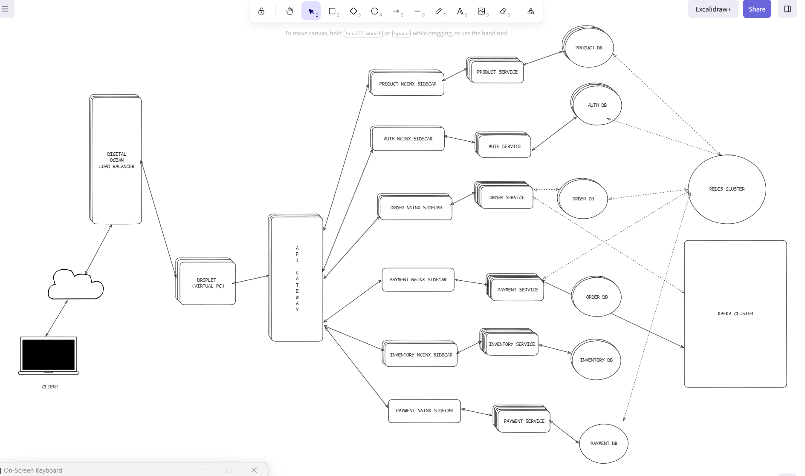

# Distributed MarketPlace
A Production-grade distributed Distributed Marketplace built on Node.js 20, TypeScript 5, MongoDB, Apache Kafka, and the full Grafana observability stack.

## Table of Contents
1. [Project Goals](#project-goals)
2. [System Architecture](#system-architecture)
3. [Service Catalogue](#service-catalogue)
4. [Technology Stack](#technology-stack)
5. [Infrastructure Overview](#infrastructure-overview)
6. [Architectural Patterns](#architectural-patterns)
7. [Observability & Monitoring](#observability--monitoring)
8. [Getting Started](#getting-started)
9. [Environment Variables](#environment-variables)
10. [Testing Strategy](#testing-strategy)
11. [Performance Benchmarks](#performance-benchmarks)
12. [Roadmap](#roadmap)


### Project Goals:
The essence of me building this project is to show in simple terms on how to build an event driven microservice, and enterprise grade 
applications with core engineering focus on the following:

1. **Distributed Systems**: Kafka-backed event choreography, saga patterns, outbox/inbox for exactly-once semantics, and CDC via Debezium.

2. **Multi-Tenant Architecture**: Tenant isolation at the data and billing layer, supporting SELLER_INDIVIDUAL, SELLER_BUSINESS, MARKETPLACE, and FRANCHISE tenant types with FREE / PRO / ENTERPRISE billing plans.

3. **Observability-First Design**: Every service ships structured JSON logs (Winston → Loki), Prometheus metrics, and distributed traces (OpenTelemetry → Tempo), all surfaced in Grafana.

4. **Security Depth**: JWT with refresh-token rotation, 2FA (email/SMS/TOTP), RBAC with hierarchical role levels, token-bucket rate limiting, and false-identification flagging.

5. **Resilience Engineering**: Chaos Engineering (K6 tests), Graceful shutdown sequences, Kafka consumer retry + DLQ patterns, Redis-backed idempotency, MongoDB replica sets.


## System Architecture


## Service Catalogue

| Service | Port | Description | Docs |
|---------|------|-------------|------|
| **API Gateway** | 8000 | Reverse proxy, circuit breaker, rate limiting, request valdiation, auth guard, metrics aggregation | [Docs](./api-gateway/readme.md) |
| **Authentication** | 4001 | Registration, 2FA login, JWT, RBAC, refresh rotation | [Docs](./authentication/readme.md) |
| **Products** | 4003 | Product CRUD, variant management, search | [Docs](./products/readme.md) |
| **Inventory** | 4008 | Stock levels, reservations, replenishment alerts | [Docs](./inventory/readme.md) |
| **Cart** | 4009 | Session cart, Distributed locks with TTL, Redis versioned caching, pricing, coupon application |  [Docs](./cart/readme.md) |
| **Orders** | 4012 | Order lifecycle, saga orchestration |  [Docs](./orders/readme.md) |
| **Payment** | 4004 | Stripe/Paystack, webhooks, saga compensation | [Docs](./payment/README.md) |
| **Stores** | 4007 | Store creation, theme, custom domain (roadmap) | [Docs](./stores/README.md) |
| **Tenant** | 4010 | Tenant provisioning, billing plan management |  [Docs](./tenant/README.md) |
| **Notification** | 4006 | Email/SMS dispatch, template engine |  [Docs](./notification/README.md) |
| **Review** | 4011 | Product reviews, moderation, rating aggregation |  [Docs](./review/README.md) |
| **Audit** | 4002 | Immutable event log, compliance reporting | [Docs](./audit/README.md)  |


## Technologies & Libraries


### Core Stack.
1. **Node.js version 20**: The main runtime environment
2. **Typescript version 5**: For typesafe environment
1. **Express 4.18** : Web framework
1. **Citus 13.0.3** : Distributed PostgreSQL
1. **Redis 7.0** : In memory cache and session store
1. **Apache Kafka 3.6** : Event streaming platform

### **Database Layer**
1. **nodejs postgress (pg)**: PostgreSQL client with connection pooling
1. **Debezium version 2.4**: My main change data capture connector
1. **pg bouncer**: For connection pooling ( helps me to create resusauble TCP connection to the database server)
1. **ioredis)**: A redis client that supports also cluster mode


### **Authentication & Security**
1. **jsonwebtoken**: Mainly used to generate JWT tokens and also for token verification.
1. **bcrypt**: Used to generate non reversible hash content for password.
1. **helmet** :Security headers middleware
1. **express.rate-limit** : DDoS protection

### **Monitoring & Observability**
1. **Prometheus** Metrics collection
1. **Grafana** Visualization dashboards
1. **Loki** Log aggregation
1. **Promtail**: For log collection and routing it to Loki for aggregation.
1. **Tempo** : Distributed tracing
1. **OpenTelemetry** : Instrumentation SDK
1. **Winston** : Structured logging


## Infrastructure Overview

### Kafka Cluster (KRaft mode, no ZooKeeper needed for cordination)

3-broker cluster with combined broker+controller roles:

- `KAFKA_MIN_INSYNC_REPLICAS: 2` : writes require 2 of 3 replicas to acknowledge
- `KAFKA_DEFAULT_REPLICATION_FACTOR: 3` : every topic replicated to all brokers
- `KAFKA_AUTO_CREATE_TOPICS_ENABLE: false` : topics provisioned explicitly
- Producer idempotency enabled: `idempotent: true`, `acks: -1`


### Redis

Roles: 2FA token store, onboarding session state, user cache, refresh token store, rate-limit counters.
TTL discipline: all keys use explicit `SETEX` : no unbounded keys.

### MongoDB
Per-service databases (no cross-service joins). Mongoose with sessions for multi-document ACID transactions. Indexes declared on schema, not ad hoc.


## Architectural Patterns

### Saga (Choreography)
Each service has a local transaction and the service is responsible for sending events to the next service once the she has seen that her internal transaction 
has been completed. In cases, where the internal transaction of the service fails, the service should send compensating event to the previous
service that it receives her first transaction from.


Example: `User Onboarding`
```
Auth → USER_ONBOARDING_COMPLETED_TOPIC → Tenant Service
Tenant → TENANT_ONBOARDING_COMPLETED_TOPIC → Auth (update tenantId)
Tenant → NOTIFICATION_TENANT_ONBOARDING_COMPLETED_TOPIC → Notification
```

Compensation: `USER_ROLLBACK_TOPIC` triggers soft-delete of user record if tenant provisioning fails

### Outbox Pattern

To achieve a state of consistency between the primary db of a service and a messaging system, I made use of the OUTBOX pattern using the db transactional log. 
Note, In some cases I basically poll from a 2nd table that has a transactional context with the primary database. Once a write command has been processed by the 
DB, the write event, and its payload will first be persisted in the WAL files for crash wrecovery purposes. I then make us of Debezium to stream the appendable log
and send it to the Kakfa broker so the downstream consumer service can act on the data. 


### Inbox Pattern

Consumers persist a processed message ID before acting on it. Duplicate Kafka deliveries (at-least-once) are silently dropped : idempotent consumption.

### CQRS

Read models (caches, projections) maintained via Kafka CDC events from write-side MongoDB. Queries hit Redis projections; writes go to MongoDB.


## Observability & Monitoring

Every service exposes:
- `GET /health` : liveness probe (Docker healthcheck)
- `GET /metrics` : Prometheus scrape endpoint

Trace context injected into Winston logs via `@opentelemetry/instrumentation-winston`:
```json
{
  "level": "info",
  "message": "User signed in",
  "trace_id": "4bf92f3577b34da6a3ce929d0e0e4736",
  "span_id": "00f067aa0ba902b7",
  "service": "auth_service"
}
```


Grafana datasources provisioned automatically on startup: Loki, Tempo, Prometheus.

---

## Getting Started

### Prerequisites

- Docker Engine 24.x+ and Docker Compose 2.x+
- Node.js 20.x+ (local dev only)
- 16GB RAM recommended (8GB minimum)

### Start Full Stack

```bash
git clone 
cd marketplace-api

# Copy and fill env files per service
cp api-gateway/.env.example api-gateway/.env
cp authentication/.env.example authentication/.env
# ... just repeat the same abiwve flow for each service

docker compose up -d
```

### Service Endpoints (local)

| Service | URL |
|---------|-----|
| API Gateway | http://localhost:8000 |
| Grafana | http://localhost:3000 |
| Kafka UI | http://localhost:8080 |
| Prometheus | http://localhost:9090 |
| Loki | http://localhost:3100 |
| Tempo | http://localhost:3200 |

### Run Tests

```bash
cd authentication && npm test

k6 run tests/k6/auth-load.js
k6 run tests/k6/stress.js
```

---

## Environment Variables

Each service requires a `.env` file. Common variables across services:

```bash
NODE_ENV=development
PORT=
DATABASE_URL=mongodb://:27017/
REDIS_URL=redis://redis:6379
JWT_SECRET=
JWT_REFRESH_SECRET=
WEB_ORIGIN=http://localhost:3000
```

See each service's `README.md` for service-specific variables.

---

## Testing Strategy

### Testing Plan
1. E2E will most take 10 percent of my testing structure
2. Integration will most take 20 percent of my testing structure
2. For the Unit tests, it will take 70 percent of my testing structure

### Coverage Targets

| Tier | Target |
|------|--------|
| Unit | > 80% |
| Integration | > 60% |
| E2E | Critical paths only |

### Load Testing (k6)

- **Load test** : I am checking the base load the API can hold. So I will be using 4000 VU over a 4 min period.
- **Stress test** : For this test, I am just trying to see at what request the PAI will fail. So I will be using 7000 VUs
- **Spike test** : I will increase the stress test to 10 percent, to see how well it can handle sudden traffic
- **Strain test** : So for this test, I will just use the base load I made use of in the load test to see how well the
system can sustain it for a 10 min period.
