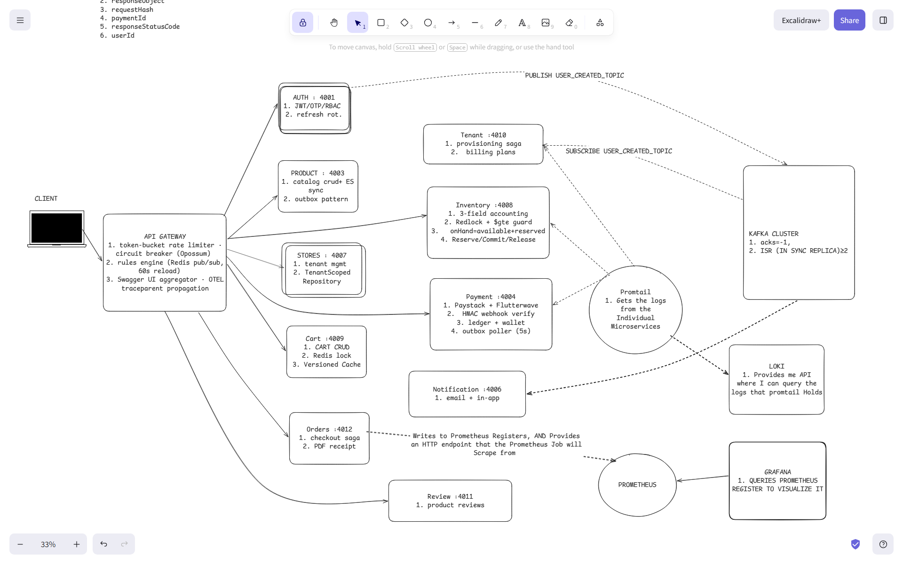

# Selleasi

I built Selleasi as a Shopify-style multi-tenant marketplace platform where each store is an isolated tenant. Every data record is scoped by `storeId` and `tenantId`. I mostly favour consistency over availability: inventory reservation is synchronous and fail-fast, payment writes are atomic, and I publish every critical event through a transactional outbox so a Kafka outage never causes a split-brain between the payment record and the event stream.

The API is built with the stack on Node.js 20, TypeScript 5, MongoDB Atlas, Apache Kafka (KRaft), Redis, and the full Grafana observability stack.

---

## Table of Contents

1. [System Architecture](#system-architecture)
2. [Service Catalogue](#service-catalogue)
3. [Technology Stack](#technology-stack)
4. [Infrastructure Overview](#infrastructure-overview)
5. [Architectural Patterns](#architectural-patterns)
6. [Kafka Choreography Chain](#kafka-choreography-chain)
7. [Observability](#observability)
8. [Getting Started](#getting-started)
9. [Environment Variables](#environment-variables)
10. [Testing Strategy](#testing-strategy)
11. [Performance Benchmarks](#performance-benchmarks)
12. [Architecture Decision Records](#architecture-decision-records)
13. [Roadmap](#roadmap)

---
## System Architecture

I route all client traffic through the API Gateway at port 8000, where I enforce token-bucket rate limiting and circuit breaking via Opossum before proxying downstream. Inventory and payment are my consistency boundary: reservation is synchronous and fail-fast, payment commits atomically. Kafka basicaLLY sits downstream and handles all async choreography without blocking the request path. The observability stack sits outside the request path entirely.



---

## Service Catalogue

| Service | Port | Status | Responsibility |
|---|---|---|---|
| api-gateway | 8000 | Production | Reverse proxy, token-bucket + sliding-window rate limiter, Opossum circuit breaker, rules engine, Swagger UI aggregator |
| auth | 4001 | Production | Registration, OTP 2FA, JWT issuance, refresh-token rotation, blocklist on logout, RBAC |
| audit | 4002 | In progress | Audit log trail for admin and seller actions |
| products | 4003 | Production | Product CRUD, variant management, transactional outbox, Elasticsearch sync |
| payment | 4004 | Production | Paystack/Flutterwave integration, HMAC webhook verification, ledger, wallet, outbox poller |
| categories | 4005 | In progress | Product category taxonomy |
| notification | 4006 | Production | Email dispatch, in-app notifications, receipt delivery |
| stores | 4007 | Production | Store/tenant creation, TenantScopedRepository base class |
| inventory | 4008 | Production | Three-field stock accounting (onHand = available + reserved), Redlock, TTL reservations |
| cart | 4009 | Production | Per-store per-user cart state, Redis distributed lock, versioned cache |
| tenant | 4010 | Production | Tenant provisioning saga, billing plan management |
| review | 4011 | Production | Product reviews, scoped by storeId |
| orders | 4012 | Production | Checkout saga orchestration, order state machine, PDF receipt generation |
| color | 4013 | In progress | Color catalogue for product variants |
| view | 4014 | In progress | Storefront view aggregation |
| size | 4015 | In progress | Size catalogue for product variants |
| users | 4016 | In progress | User profile management |

---

## Technology Stack

**Runtime.** Basically I run every service on Node.js 20 and TypeScript 5 with Express 4. All Dockerfiles use `node:20-alpine` as the base image and `npm ci --omit=dev` to keep production images lean.

**Databases.** For the DB, i make use of MongoDB Atlas via Mongoose with a dedicated database per service. There are no cross-service joins. I use multi-document ACID transactions via `withSession`/`withTransaction` for operations that must be atomic across multiple collections. All indexes are declared on the schema.

**Caching and coordination.** I use Redis 7 via ioredis for rate-limit counters, OTP TTL storage, refresh-token storage, Redlock distributed mutexes for inventory writes, idempotency NX keys for Kafka consumers, cart versioned cache, and pub/sub for rules-engine cache invalidation.

**Event streaming.** Apache Kafka 3 in KRaft mode with no ZooKeeper is what ia m using. In dev I run a 3-broker Docker Compose cluster. In prod I basicalluy use Confluent Cloud to avoid the ~6 GB broker RAM overhead on a 4 GB VPS. I configure `acks=-1`, `idempotent: true`, `MIN_INSYNC_REPLICAS=2`, and `AUTO_CREATE_TOPICS_ENABLE=false`. Partition counts are derived from the LCM of each topic's consumer group sizes for even distribution.

**Search.** I use Elasticsearch 8.11 with `@elastic/elasticsearch` v8.19.1. In dev I run a single node with a 512m heap and `xpack.security=false`. In prod I run a cluster. I use an ngram tokenizer (min=3, max=10) at index time for partial match and a standard tokenizer at query time to avoid over-matching. MongoDB is my source of truth. ES is an eventually consistent read replica I sync via Kafka outbox events.

**Payment.** I integrate both Paystack and Flutterwave. The PSP is selected per request. I verify every webhook with HMAC signature validation per gateway and deduplicate payloads with a SHA-256 hash stored inside the same MongoDB transaction as the payment record update.

**File storage.** I store PDF receipts and product images on Cloudinary.

**Receipt generation.** I generate receipts in memory using pdfkit with a qrcode verification URL embedded as a QR code. I upload the buffer directly to Cloudinary and persist the `receiptUrl` on the order document, then include it in the `ORDER_COMPLETED` Kafka event payload.

**Observability.** I scrape Prometheus metrics from every service at `/metrics`. I use Grafana for dashboards covering latency histograms, error rates, and circuit breaker state. I aggregate structured JSON logs in Loki and ship distributed traces to Tempo via OTEL. I inject `trace_id`, `span_id`, and `trace_flags` into every log record via Winston instrumentation.

---

## Infrastructure Overview

**Dev.** I use Docker Compose with a 3-broker Kafka KRaft cluster, single-node Elasticsearch, and Nginx for SSL termination. The full stack needs a minimum of 8 GB RAM; I recommend 16 GB.

**Prod.** I deploy to a single 4 GB VPS. I use Confluent Cloud for Kafka, MongoDB Atlas for the database, and Cloudflare for DNS and DDoS mitigation. I deploy via GitHub Actions CI/CD over SSH.

**Healthchecks.** Every service exposes `GET /health` as the Docker healthcheck target and `GET /metrics` as the Prometheus scrape target.

**Service startup dependencies.**

For a checkout to succeed I need these services healthy in order:

```
MongoDB + Redis + Kafka
  > auth (JWT issuance)
  > products (catalog)
  > inventory (stock accounting)
  > cart (session state)
  > orders (saga entry point)
  > payment (PSP integration)
```

I guard the products service startup with `depends_on: condition: service_healthy` on Elasticsearch because the ngram index bootstrap runs at startup and will crash if ES is not ready.

---

## Architectural Patterns

### Outbox pattern

For payment I commit the status update, ledger credit, wallet balance increment, and outbox event record in a single MongoDB `withTransaction`. A poller running every 5 seconds reads unsent outbox records, publishes them to Kafka, and marks them sent. This means a Kafka outage queues events in MongoDB rather than failing the payment write or silently losing the event.

I designed `LedgerRepository.creditOnPaymentConfirmed` to accept an external session parameter so it joins the caller's transaction without opening a nested `withTransaction`, which MongoDB does not support.

I use the same pattern in the products service: I write the product document and the `OutboxEvent` in the same transaction, and the poller publishes `PRODUCT_ONBOARDING_COMPLETED_TOPIC`.

### Saga choreography

I use choreography with no central orchestrator. Each service reacts to Kafka events in a sequential flow, runs its local transaction, and publishes the next event. I run compensation in reverse order: if inventory reservation fails for item N, I release reservations for items 0..N-1 synchronously before emitting `order.reservation.failed.topic`.

I made inventory reservation during checkout synchronous HTTP deliberately. The trade-off is higher checkout latency in exchange for zero oversell. I accept that trade-off.

### Inventory three-field accounting

```
Invariant:  onHand = available + reserved   (enforced at every write)

Reserve:    available -= N  ($gte: N guard, fails atomically if insufficient)
            reserved  += N

Commit:     onHand    -= N  (permanent sale, triggered by ORDER_STOCK_COMMITTED)
            reserved  -= N

Release:    available += N  (compensation or TTL expiry)
            reserved  -= N
```

I use MongoDB `$inc` inside a Redlock distributed lock scoped per product for all three operations. The `$gte` guard is part of the query predicate, making the check-and-decrement atomic with no application-level check-then-act race.

### Idempotency

I set a Redis NX key (`eventType:messageId`) before processing any Kafka message. A duplicate delivery results in a silent drop and offset commit. For webhooks I store a SHA-256 hash of the payload inside the same `withTransaction` as the payment update. This protects against duplicates even after the NX key TTL expires.

### Circuit breaker

I use Opossum at the gateway with a custom `errorFilter` that ignores 4xx responses. Only 5xx responses and timeouts increment the failure counter and move the breaker toward open. This prevents validation errors under load from tripping the breaker on a healthy service.

### JWT and token rotation

I issue short-lived stateless access tokens (15-minute TTL) that I never check against Redis on the hot path. Refresh tokens are stateful `nanoid(32)` strings with a 7-day TTL in Redis. I rotate on every use: I delete the old token before writing the new one in a single Redis pipeline. On logout I write a blocklist key per `userId` with TTL equal to the remaining access token lifetime. The JWT payload carries `userId`, `role`, `tenantId`, `tenantType`, `tenantPlan`, `permissions`, and `roleLevel`.

I never read `tenantId` from the request body or params. I always inject it from the verified JWT.

---

## Kafka Choreography Chain

```
payment.confirmed (outbox poller, 5s)
  > order.payment.completed.topic
       > orders:     status = COMPLETED
                      generate PDF receipt (pdfkit + qrcode)
                      upload to Cloudinary, persist receiptUrl
                      emit order.completed.topic { receiptUrl }
       > inventory:  commitStock per line item
                      emit order.stock.committed.topic
                        > cart:          clearCartByStoreId
                        > notification:  send confirmation email with receiptUrl

payment.initiated (outbox poller, 5s)
  > order.payment.initiated.topic
       > orders: status = PAYMENT_INITIATED

order.payment.failed.topic
  > orders:     status = FAILED
  > inventory:  releaseStock per line item
  > payment:    payment record = FAILED

order.reservation.failed.topic  (emitted by inventory on $gte guard failure)
  > orders: status = OUT_OF_STOCK
             emit cart.item.out.of.stock.topic
               > cart: markItemsUnavailable

product.onboarding.completed.topic (outbox poller, 5s)
  > inventory:  createInventoryRecord
  > es-sync:    upsert ES document (idempotent, MongoDB _id as ES doc _id)
```

Every consumer I wrote shares the same guarantees:

- Double `context.with()` for OTEL trace propagation across Kafka message boundaries
- Exponential backoff with jitter: `delay = 2^attempt * BASE_DELAY + random(JITTER)`
- Redis NX idempotency key per `eventType:messageId`
- Manual `commitOffsets` only after the handler completes successfully
- DLQ routing after `MAX_RETRIES` exhausted or on unrecoverable parse failure

---

## Observability

I propagate trace context end-to-end across both HTTP and Kafka boundaries.

Over HTTP: the gateway injects `traceparent` and `tracestate` (W3C + B3 composite propagator) into every proxied request. Downstream services extract and continue the span.

Over Kafka: I inject `traceparent` into message headers via `propagation.inject` on the producer side. On the consumer side I extract the header, restore the parent context with `context.with()`, and create a `SpanKind.CONSUMER` child span. I always call `span.end()` in `finally`.

In logs: Winston instrumentation reads the active span and injects `trace_id`, `span_id`, and `trace_flags` into every log record. I correlate logs to traces in Grafana by clicking the `trace_id` field in the Loki log explorer, which jumps directly to the Tempo trace.

I provision all Grafana datasources (Loki, Tempo, Prometheus) automatically on stack startup via the config in `_infrastructure/grafana/`.

| Endpoint | Purpose |
|---|---|
| http://localhost:3000 | Grafana (dashboards, log explorer, trace viewer) |
| http://localhost:9090 | Prometheus (raw metrics) |
| http://localhost:3100 | Loki (log aggregation) |
| http://localhost:3200 | Tempo (distributed traces) |
| http://localhost:8080 | Kafka UI |
| http://localhost:8000/api-docs | Swagger UI (all 53 endpoints aggregated) |

---

## Getting Started

### Prerequisites

Docker Engine 24+ and Docker Compose 2+. Node.js 20+ for running scripts outside containers.

### Start the stack

```bash
git clone https://github.com/<your-org>/selleasi.git
cd selleasi

# Copy env files for every service
for svc in api-gateway auth products stores inventory cart orders payment notification tenant review; do
  cp $svc/.env.example $svc/.env
done

# Fill in secrets before starting (see Environment Variables section)
docker compose -f docker-compose.dev.yml up -d
```

### Verify the stack is healthy

```bash
# All containers should show healthy or running
docker compose ps

# Confirm the gateway is up
curl -f http://localhost:8000/health

# Confirm Elasticsearch is healthy (products service depends on this at startup)
curl -f http://localhost:9200/_cluster/health

# Confirm Kafka has the expected topics
docker exec kafka-1 kafka-topics.sh --bootstrap-server localhost:9092 --list
```

### Seed development data

```bash
cd _infrastructure/scripts/seed
cp .env.seed.example .env.seed
# You can fill in AUTH_DATABASE_URL, PRODUCTS_DATABASE_URL, STORES_DATABASE_URL, KAFKA_BROKERS
npm install
npm run seed

# To wipe all seeded data and re-seed from scratch
npm run seed -- --destroy
```

The seed script creates 4 customers, 4 sellers, 4 admins, and 4 investors (all use `Password@123`). Each seller gets one store and 4 products. Seller registration emits `USER_ONBOARDING_COMPLETED_TOPIC` and the tenant provisioning saga runs asynchronously. The script is idempotent via a `_seedTag` field and safe to run multiple times without `--destroy`.

---

## Environment Variables

Common across all services:

```bash
NODE_ENV=development
PORT=                   
MONGO_URI=mongodb://localhost:27017/<service-db>
REDIS_URL=redis://localhost:6379
JWT_SECRET=
JWT_REFRESH_SECRET=
OTEL_SERVICE_NAME=             # matches service label in Grafana
INTERNAL_SECRET=               # shared secret for x-internal-secret header
KAFKA_BROKERS=localhost:9092,localhost:9093,localhost:9094
```

Payment service:

```bash
PAYSTACK_SECRET_KEY=
PAYSTACK_WEBHOOK_SECRET=
FLUTTERWAVE_SECRET_KEY=
FLUTTERWAVE_WEBHOOK_SECRET=
CLOUDINARY_URL=
```

Products and Elasticsearch:

```bash
ELASTICSEARCH_URL=http://elasticsearch:9200
```

See each service's `.env.example` for the complete variable list.

---

## Testing Strategy

I weight my test pyramid toward unit tests at 70%, integration tests at 20%, and load tests at 10%. Business logic lives in the service and repository layers and that is where the majority of my coverage sits. Controller-level integration tests cover the full HTTP stack and are where I catch contract regressions.

### Unit tests (70%)

I test the service layer and repository layer in isolation with mocked dependencies. I mock Mongoose models, Redis, and any external HTTP calls. This tier covers the business rules I care most about: inventory accounting invariants, saga compensation logic, token rotation, ledger credit operations, and idempotency key handling.

```bash
cd <service>
npm test
npm run test:coverage
```

### Integration tests (20%)

I target controllers in my integration tests. A real HTTP request enters the Express router, passes through all middleware (auth, rate limiter, validation, `requireTenant`), and hits the service layer against a real MongoDB instance running in Docker. This is where I catch middleware ordering bugs, wrong HTTP status codes, malformed response shapes, and auth bypass regressions. I do not test repositories or service methods directly at this tier since that is already covered by the unit suite.

```bash
# Requires the Docker Compose stack to be running
npm run test:integration
```

### Load tests (k6, 10%)

Three scenarios pending execution against the full live stack:

**Checkout end-to-end.** Ramp 10 to 100 VUs over 5 minutes. Assert p95 latency < 2s and error rate < 1%.

**Rate limiter precision.** Send exactly N+1 concurrent requests to a token-bucket-limited route. Assert exactly 1 receives HTTP 429.

**Webhook idempotency under concurrency.** Send the same `transactionId` payload 10 times simultaneously. Assert exactly 1 write reaches MongoDB.

```bash
cd _infrastructure/k6
k6 run checkout.js
k6 run rate-limiter.js
k6 run webhook-idempotency.js
```

---

## Performance Benchmarks

Load tests are pending execution. I will update this section with real p50/p95/p99 latency numbers, throughput (req/s), error rate under 100 VUs, and circuit breaker trip thresholds once I have k6 results.

Known latency constraints I designed in deliberately:

Inventory reservation is synchronous HTTP during checkout. It adds one internal round-trip per line item before the order document is created. I chose this over async reservation to eliminate oversell.

I always fetch the payment amount from the order record via internal HTTP. I never trust the client-supplied amount. This adds one round-trip per payment initialisation.

Receipt PDF generation (pdfkit + qrcode + Cloudinary upload) is asynchronous. It happens after order completion via Kafka and does not block the checkout response.

---

## Architecture Decision Records

I document all ADRs in [`_documentation/adr/`](./_documentation/adr/). Each covers the context I was in, the decision I made, and the consequences I accepted.

**Elasticsearch**

| ADR | Decision |
|---|---|
| ADR-ES-001 | Node 18 is incompatible with ES client v9, so I upgraded to Node 20 |
| ADR-ES-002 | I moved the ES client from devDependencies to dependencies |
| ADR-ES-003 | I use the Docker Compose service hostname for inter-container ES connections, not localhost |
| ADR-ES-004 | I set `max_ngram_diff: 7` to support the ngram tokenizer min/max range I needed |
| ADR-ES-005 | ES bootstrap blocks service startup; I accepted this with a `depends_on: service_healthy` guard |
| ADR-ES-006 | I sync ES via the outbox pattern rather than writing directly from the HTTP handler |
| ADR-ES-007 | I use MongoDB `_id` as the ES document `_id` for idempotent upserts |
| ADR-ES-008 | I soft-delete in ES with an `isDeleted: true` filter rather than hard-deleting documents |
| ADR-ES-009 | I use a separate `ngram_analyzer` at index time and `search_analyzer` at query time |
| ADR-ES-010 | ES is not my source of truth. MongoDB is. I treat ES as a search read replica only |
| ADR-ES-011 | I route to a DLQ after `MAX_RETRIES` for failed ES sync Kafka messages |
| ADR-ES-012 | I run single-node in dev and a cluster in prod |

**Products**

| ADR | Decision |
|---|---|
| ADR-PRODUCT-001 | I use a transactional outbox for product creation event publishing |

I document service-level ADRs for auth, orders, payment, inventory, and cart in their respective `_documentation/service_docs/<service>/architecture/decision/` directories.

---

## Roadmap

**Load testing.** I have the k6 scripts scaffolded in `_infrastructure/k6/`. I need to execute them against the full stack and record real numbers. Target: p95 < 2s under 100 VUs.

**Payout completion.** I need to add a seller bank account model, wire up the Paystack Transfer API on admin approval, handle the `transfer.success` and `transfer.failed` webhooks, and apply a PAYOUT debit to the ledger on success.

**Job scheduler.** I plan to replace the `setInterval`-based reservation expiry with a Redis sorted set scheduler, add a Friday 09:00 payout batch job, and add order abandonment reminders (1hr email, 24hr cancel + inventory release). I will use Redlock leader election with a heartbeat watchdog to ensure only one scheduler instance runs at a time.

**Documentation.** I am working through individual service flow diagrams and per-service documentation covering `api/contracts.md`, `api/error-codes.md`, `architecture/decision/*.md`, and `operations/runbook.md` for each production service.